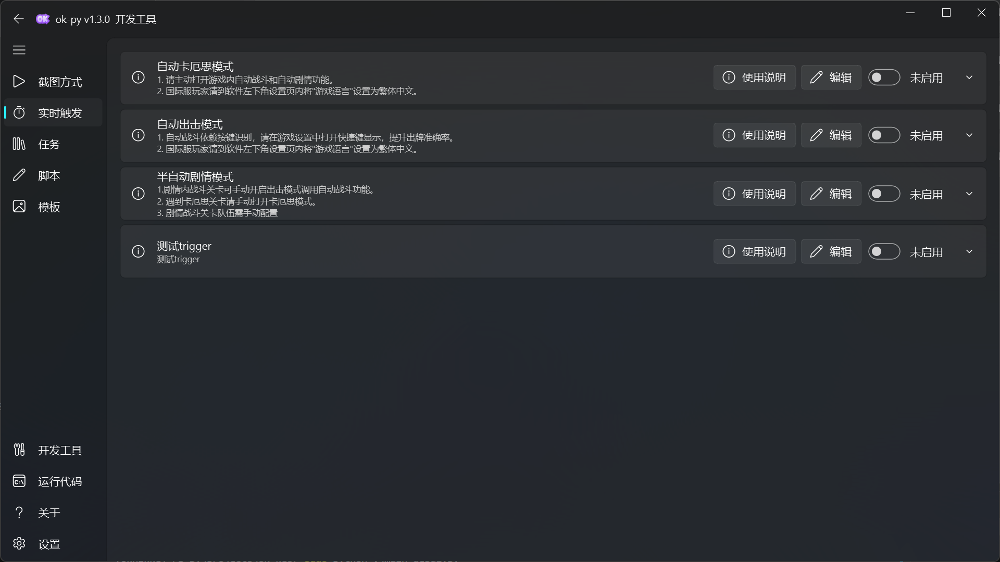
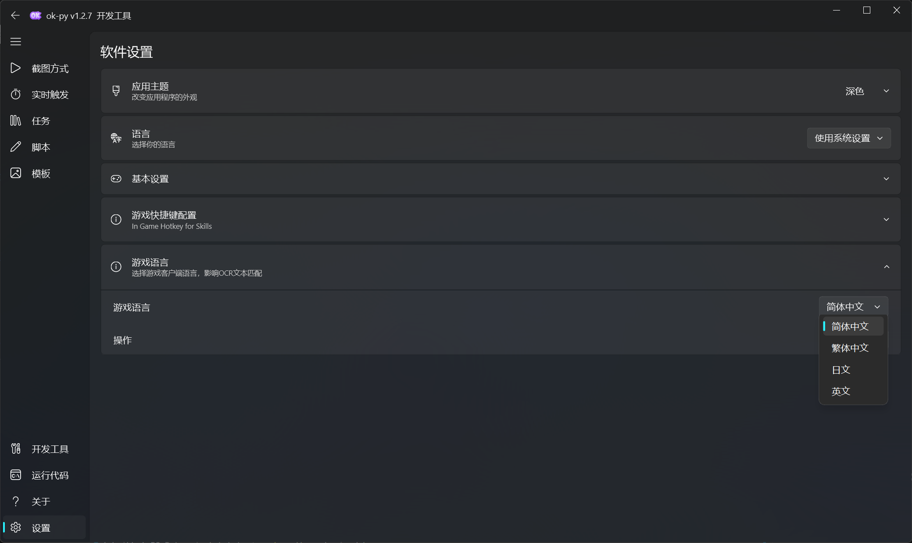

<div align="center">
  <h1 align="center">
    
    <br/>
    ok-kes
  </h1> 
  
  <p>
    一个基于图像识别的卡厄思梦境自动化辅助工具，支持后台运行，基于 <a href="https://github.com/ok-oldking/ok-script">ok-script</a> 开发。
    <br />
    An image-recognition-based automation tool for Chaos Zero Nightmare (卡厄思梦境), with background mode support, developed with <a href="https://github.com/ok-oldking/ok-script">ok-script</a>.
  </p>
  
  <p><i>通过 Windows 接口模拟用户进行操作，无内存读取、无文件修改</i></p>
  <p><b>✅ 支持国际服繁体中文 & 国服 PC 客户端</b></p>
</div>

<!-- Badges -->
<div align="center">
  

[](https://github.com/baoxin1100/ok-kes/releases)
[](https://github.com/baoxin1100/ok-kes/releases)
[](https://discord.gg/vVyCatEBgA)

</div>

### [English Readme](README_en.md) | 中文说明

---

## ⚠️ 免责声明

本软件为外部辅助工具，旨在自动化《卡厄思梦境》的部分游戏流程。它完全通过模拟常规用户界面与游戏交互，遵循相关法律法规。本项目旨在简化用户的重复性操作，不会破坏游戏平衡或提供不公平优势，也绝不会修改任何游戏文件或数据。

本软件开源、免费，仅供个人学习与交流使用，请勿用于任何商业或营利性目的。开发者团队拥有本项目的最终解释权。因使用本软件而产生的任何问题，均与本项目及开发者无关。

**使用本软件即表示您已阅读、理解并同意以上声明，并自愿承担一切潜在风险。**

## 🚀 快速开始

1. **下载安装包**：从下方的"下载渠道"中选择一个，下载最新的安装文件。
2. 运行程序：右击以管理员模式运行 `.exe` 文件（无需安装，首次启动会弹出防火墙提示，请允许通过）。

## 📥 下载渠道

* **[GitHub](https://github.com/baoxin1100/ok-kes/releases)**: 官方发布页。（**请下载 `ok-kes-win32-portable-v*.exe` 文件，而不是 `Source Code` 源码压缩包**）

## ✨ 主要功能



### 自动出击模式
- 🎮 自动战斗：基于按键识别的智能出牌，支持玩家配置出牌优先级
- 🃏 自动选牌：自动获取、移除、复制、闪光卡牌
- ⚔️ 主战员选择：自动按优先级选择出站主战员
- 🛣️ 路线选择：智能识别节点类型，按优先级自动前进
- 🏪 商店处理：自动进入德朗商店移除卡牌
- 💊 以太补充检测：检测体力不足时自动停止出击任务
- 支持自定义卡牌优先级、移除/复制/闪光列表等配置

### 自动卡厄思模式
- 🃏 自动卡牌管理：移除、复制、闪光、赋予闪光、转换等
- 🛣️ 路线选择：自动识别休息/事件/boss/小怪节点
- 🏥 精神崩溃治疗：自动前往创伤中心治疗
- 📦 存储数据处理：自动删除存档（可配置保留）
- 🏪 商店处理：自动进入德朗商店
- 🌀 零式系统支持：自动处理法典搜索
- 更多功能持续开发中...

### 半自动剧情模式
- 💬 自动对话：跳过剧情对话
- ⚠️ 遇到战斗或卡厄思关卡时可手动切换对应模式

### 配置导入导出
- 📤 **导出配置**：一键将当前模式配置编码为文本并复制到剪贴板，可分享给他人
- 📥 **导入配置**：粘贴他人分享的配置编码即可应用配置，支持不同版本间互相导入

### 通用功能
- 🖥️ **高分辨率支持**: 支持 1920x1080 / 1600x900 / 1280x720 等 16:9 分辨率
- 🔄 **后台模式**: 支持游戏窗口最小化或被遮挡时在后台运行
- 📱 **ADB 手机模式**: 支持通过 ADB 截取 Android 真机/模拟器画面并注入点击、滑动和按键
- 🌏 **多语言游戏支持**: 支持简体中文、繁体中文客户端（需在软件左下角设置页内将"游戏语言"设置为对应语言）
  

## 🔧 使用说明

1. **国际服玩家必读**：请到软件左下角设置页内将"游戏语言"设置为繁体中文
2. **自动战斗**：依赖按键识别，请在游戏设置中打开快捷键显示，提升出牌准确率
3. **卡厄思模式**：请主动打开游戏内自动战斗和自动剧情功能
4. **剧情模式**：战斗关卡可手动开启出击模式调用自动战斗功能；遇到卡厄思关卡请手动打开卡厄思模式；战斗关卡队伍需手动配置

### ADB 手机模式

1. 在 Android 设备上开启开发者选项和 USB 调试，用 USB 连接电脑并确认调试授权。
2. 手动打开游戏，使用横屏 16:9 分辨率，并保持手机解锁。
3. 在软件首页点击刷新：已授权设备会显示为“Android 已连接”；未授权、离线或未检测到设备时，列表顶部会显示对应处理提示。
4. 如果显示“USB 调试未授权”，请解锁手机，在 USB 调试弹窗中勾选“始终允许”并点“允许”，然后再次刷新。
5. 无线 ADB 需要先在系统 ADB 工具中完成配对和连接，再回到软件刷新设备列表。

ADB 模式不会自动修改手机分辨率或启动特定渠道的游戏包，运行任务前请确认游戏已在前台。
全面屏手机的截图比例可能宽于 16:9；手机模式会跳过仅适用于 Windows 窗口的 16:9 启动校验，并保留框架的宽屏坐标适配。

## 🔧 疑难解答 (Troubleshooting)

如果遇到问题，请在提问前按以下步骤逐一排查：

1. **杀毒软件**：将软件所在目录添加到杀毒软件（包括 Windows Defender）的**信任区或白名单**中，以防文件被误删或拦截。
2. **显示设置**：
   * 关闭所有显卡滤镜（如 NVIDIA Game Filter）和锐化功能。
   * 使用游戏默认的亮度设置。
   * 关闭任何在游戏画面上显示信息的叠加层。
3. **游戏分辨率**：请确保游戏分辨率设置为 16:9 比例。
4. **软件版本**：检查并确保您使用的是最新版本。
5. **寻求帮助**：如果以上步骤都无法解决您的问题，请通过社区渠道提交详细的错误报告。

---

## 💻 开发者专区

### 从源码运行 (Python)

本项目基于 conda 的 `oknikke` 环境（Python 3.12）。

```bash
# 安装或更新依赖
pip install -r requirements.txt --upgrade

# 运行 Release 版本
python main.py

# 运行 Debug 版本
python main_debug.py
```

## 💬 加入我们

- **QQ 交流群**: `901988096` (入群答案: `烟火焚`)
- **QQ 频道**: [点击加入](https://pd.qq.com/s/eopggnxcu)

本项目基于 [ok-script](https://github.com/ok-oldking/ok-script) 框架开发，简单易维护。欢迎有兴趣的开发者使用 [ok-script](https://github.com/ok-oldking/ok-script) 开发您自己的自动化项目。

## 🔗 使用ok-script的项目：

* 鸣潮 [https://github.com/ok-oldking/ok-wuthering-wave](https://github.com/ok-oldking/ok-wuthering-waves)
* 原神(停止维护, 但是后台过剧情可用) [https://github.com/ok-oldking/ok-genshin-impact](https://github.com/ok-oldking/ok-genshin-impact)
* 少前2 [https://github.com/ok-oldking/ok-gf2](https://github.com/ok-oldking/ok-gf2)
* 星铁 [https://github.com/Shasnow/ok-starrailassistant](https://github.com/Shasnow/ok-starrailassistant)
* 星痕共鸣 [https://github.com/Sanheiii/ok-star-resonance](https://github.com/Sanheiii/ok-star-resonance)
* 二重螺旋 [https://github.com/BnanZ0/ok-duet-night-abyss](https://github.com/BnanZ0/ok-duet-night-abyss)
* 白荆回廊(停止更新) [https://github.com/ok-oldking/ok-baijing](https://github.com/ok-oldking/ok-baijing)

## ❤️ 致谢

* [ok-script](https://github.com/ok-oldking/ok-script)
* [OnnxOCR](https://github.com/ok-oldking/OnnxOCR)
* [PyQt-Fluent-Widgets](https://github.com/zhiyiYo/PyQt-Fluent-Widgets)
